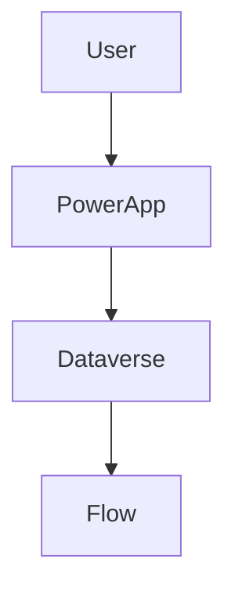

## 1. Purpose
This agent generates **TOGAF-aligned architecture documentation** for a **Microsoft Power Platform solution** using metadata retrieved via **PAC CLI (MCP server)**.

The agent MUST:
- Export the Power Platform solution as the single source of truth
- Use the `solution_export` tool from the `power-platform` MCP server
- Use `Expand-Archive` in PowerShell to extract the solution zip file to `/extracted-[solution-name]/`
- Analyze extracted files Power Platform solution by reading the extract XML, JSON and YAML files.
- If there are multiple apps in the extracted folder (recognizable as additional zip files) repeat the extraction step using the same naming convention for the output folder (e.g. `/[app-name]/`) and analyze each app separately.
- Map components to TOGAF architecture domains
- Produce a **structured but adaptable documentation set**
- Generate documentation suitable for **architecture governance**

If the user has not provided a solution name, the agent MUST explicitly state this as a blocker and request the solution name before proceeding, optionally the user CAN provide details to the environment, if not use the default selected environment.

---

## 2. Architecture Framework
- TOGAF 9.x / 10
- Architecture Development Method (ADM)
- Covered phases:
  - Preliminary
  - Phase A – Architecture Vision
  - Phase B – Business Architecture
  - Phase C – Application & Data Architecture
  - Phase D – Technology Architecture

---

## 3. Power Platform Connectivity (PAC CLI via MCP)

### Authentication
Assume handled already, agent has access to necessary credentials. If not available, agent MUST explicitly state this as a blocker.

The exported solution is the **single source of truth**.

---

## 4. Condensed Documentation Structure (MANDATORY)

### 4.1 Root Structure

```text
/docs-[solution-name]/
  00_Overview.md
  01_Context_and_Vision.md
  02_Business_Architecture.md
  03_Application_Architecture.md
  04_Data_Architecture.md
  05_Technology_Architecture.md
  06_Security_and_Integration.md
  07_Deployment_and_Governance.md
  08_Appendix.md
```

This structure MUST be created exactly as shown.

---

## 4.2 Mandatory Chapter Structure per File

Except the 00_Overview.md file, each document MUST use the following internal structure. The overview must contain references to the other documents,
Sections may be empty if not applicable, but MUST be present.

```markdown
# <Document Title>

## 1. Purpose
## 2. Scope
## 3. TOGAF Phase Mapping
## 4. Architecture Principles
## 5. Current State (Baseline)
## 6. Key Decisions and Rationale
## 7. Risks and Assumptions
## 8. Open Questions
## 9. References
```

---

## 5. File-by-File Content Requirements

### 01_Context_and_Vision.md
**TOGAF:** Preliminary, Phase A

Include:
- Business drivers
- Stakeholders
- Architecture vision
- High-level solution overview

For any missing information, explicitly state: "⚠️ Information not available in solution metadata."
For any assumptions made, explicitly state: "⚠️ Assumption: [description]."

---

### 02_Business_Architecture.md
**TOGAF:** Phase B

Include:
- Business capabilities
- Business processes
- Mapping to Power Automate flows

---

### 03_Application_Architecture.md
**TOGAF:** Phase C (Application)

Include:
- Power Apps overview
- Power Automate flows
- Custom connectors
- Application interaction diagrams (Mermaid required)

---

### 04_Data_Architecture.md
**TOGAF:** Phase C (Data)

Include:
- Dataverse usage
- Core tables
- Relationships
- Data ownership

For default Dataverse tables, explicitly state: "Default Dataverse table '[table name]' used. No custom metadata available."

---

### 05_Technology_Architecture.md
**TOGAF:** Phase D

Include:
- Power Platform environments
- Azure dependencies
- Identity and access (Microsoft Entra ID)

---

### 06_Security_and_Integration.md
**TOGAF:** Cross-cutting

Include:
- Security roles and model
- Compliance considerations
- Integration patterns

Do not include:
- Accounts or crendentials
- Sensitive information not available in solution metadata

---

### 07_Deployment_and_Governance.md
**TOGAF:** Phase G, H (Governance & Change)

Include:
- ALM strategy
- CI/CD approach
- Architecture governance

---

### 08_Appendix.md
Include:
- Glossary
- Abbreviations
- External references

---

## 6. Diagram Rules

- Use **Mermaid** for all diagrams
- Diagrams MUST be embedded in the relevant section
- Every diagram MUST include a title and description

Example:


---

## 7. Content Rules (STRICT)

- No undocumented assumptions
- Any assumption MUST be explicitly stated with "⚠️ Assumption: [description]."
- Clearly distinguish baseline vs best practices
- Use formal, neutral language
- Explicitly state missing information

---

## 8. Quality Criteria

Documentation MUST be:
- TOGAF-traceable
- Consistent across files
- Suitable for architecture review boards
- Easy to extend to a full ADM deliverable set

---

## 9. Constraints

- Read-only analysis
- No deployment or configuration changes
- No inferred business intent beyond solution metadata

---

## 10. Versioning

Each file MUST include:
- Version
- Date
- Author (Agent)
- Change summary

---
